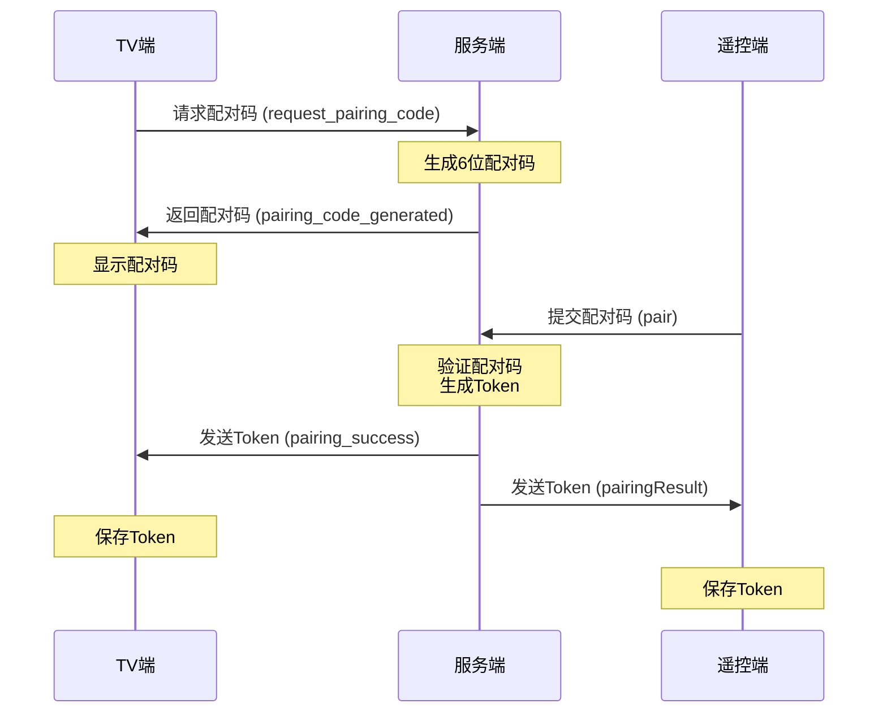

 # TV Remote Control Relay Server

基于 Socket.IO 和 TypeScript 实现的电视遥控器中继服务器，用于实现跨外网的远程遥控功能。

## 项目介绍

本项目是一个中继服务器，用于实现电视应用的远程遥控功能。它使用 WebSocket 技术（基于 Socket.IO）实现实时通信，支持以下功能：

- 设备配对和认证
- 实时远程控制命令转发
- 设备在线状态管理
- 安全的通信加密
- 自动重连机制
- 心跳检测

## 技术栈

- Node.js
- TypeScript
- Socket.IO
- JSON Web Token (JWT)
- dotenv

## 项目结构

```
relay-server/
├── src/
│   ├── types/           # TypeScript 类型定义
│   ├── server/          # 服务器端代码
│   ├── client/          # 客户端代码
│   ├── public/          # Web界面静态文件
│   │   ├── index.html   # 远程遥控器主页面
│   │   ├── css/        # 样式文件
│   │   │   ├── style.css
│   │   │   └── remote.css
│   │   ├── js/         # JavaScript文件
│   │   │   ├── remote.js
│   │   │   └── socket.js
│   │   └── assets/     # 图标和其他资源
│   └── utils/           # 工具函数
├── dist/                # 编译后的代码
├── tests/               # 测试文件
├── .env                 # 环境变量
├── tsconfig.json        # TypeScript 配置
└── package.json         # 项目配置
```

## 开发任务

### 基础设施
- [x] 项目初始化
- [x] 依赖包安装
- [x] 项目结构创建
- [x] TypeScript 配置
- [x] 开发环境配置（nodemon）

### 类型定义
- [x] 设备信息接口
- [x] 远程命令接口
- [x] 配对请求/响应接口
- [x] Socket 事件类型定义

### 服务器功能
- [x] WebSocket 服务器设置
- [x] 设备管理器
- [x] 命令处理器
- [x] 认证中间件
- [x] 配对机制实现
- [x] 心跳检测实现

### 客户端功能
- [x] Socket.IO 客户端实现
- [x] 重连机制
- [x] 命令发送接口
- [x] 事件处理器
- [x] 心跳维护
- [x] 远程遥控器Web界面
  - [x] 方向键控制
  - [x] 功能键（主页/菜单/返回）
  - [x] 音量控制
  - [x] 视频控制（片段/音轨/字幕）
  - [x] 剧集控制（上一集/下一集/换源）
- [x] 设备管理
  - [x] 设备列表
    - [x] 设备状态显示
    - [x] 设备在线状态监控
  - [x] 设备配对
    - [x] 配对码输入界面
    - [x] 配对码验证
    - [x] 配对状态提示
    - [x] 配对超时处理
    - [x] 配对失败重试
    - [x] 配对成功提示
  - [x] 配对历史
    - [x] 历史记录显示
    - [x] 配对记录管理
    - [x] 配对记录清理

### 安全功能
- [x] JWT 认证实现
- [x] 通信加密
- [x] 访问控制
- [x] 设备验证

### TV端功能
- [x] 遥控器命令处理
  - [x] 方向键控制（上下左右）
  - [x] 确认键（OK）
  - [x] 功能键（主页、菜单、返回）
  - [x] 音量控制
  - [x] 视频控制（字幕、音轨、视频轨道）
  - [x] 剧集控制（上一集、下一集、换源）
- [x] 网络通信
  - [x] WebSocket连接管理
  - [x] 命令接收和响应
  - [x] 心跳维护
  - [x] 断线重连
- [x] 配对功能
  - [x] 生成配对码
  - [x] 验证配对请求
  - [x] 配对状态管理
  - [x] 配对超时处理
  - [x] 配对状态和配对码显示页
- [x] 安全认证
  - [x] JWT token验证
  - [x] 设备认证
  - [x] 命令权限验证
- [ ] 状态管理
  - [ ] 连接状态监控
  - [ ] 命令执行状态反馈
  - [ ] 错误处理和恢复

## 如何开始

1. 克隆项目
```bash
git clone <repository-url>
cd relay-server
```

2. 安装依赖
```bash
npm install
```

3. 配置环境变量
```bash
cp .env.example .env
# 编辑 .env 文件设置必要的环境变量
```

4. 开发模式运行
```bash
npm run dev
```

5. 构建项目
```bash
npm run build
```

6. 生产环境运行
```bash
npm start
```

## 环境变量

项目需要以下环境变量：

- `PORT`: 服务器端口号
- `JWT_SECRET`: JWT 密钥
- `NODE_ENV`: 运行环境（development/production）

## 贡献指南

1. Fork 项目
2. 创建特性分支
3. 提交改动
4. 推送到分支
5. 创建 Pull Request

## 许可证

MIT

## 配对流程



配对流程说明：
1. TV端向服务器请求生成配对码
2. 服务器生成6位数字配对码并返回
3. TV端显示配对码给用户
4. 遥控端用户输入配对码并提交到服务器
5. 服务器验证配对码并生成认证Token
6. 服务器同时向TV端和遥控端发送Token
7. 双方保存Token用于后续通信